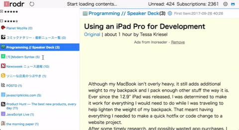
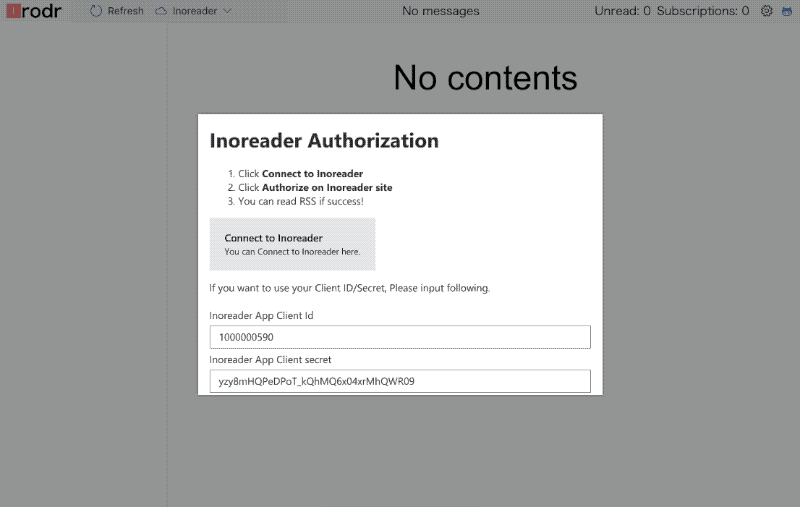

# Irodr 

RSS reader client for [Inoreader](http://www.inoreader.com/ "Inoreader").

This RSS reader provide a similar experience to [LDR](http://reader.livedoor.com/). 

## Purpose

- [x] Fast read RSS like [LDR](http://reader.livedoor.com/)
    - [x] Prefetch contents
    - [x] Mark as "read" on idle time
- [x] Keyboard Shortcut
- [x] Customizable by UserScript
    - [x] We will provide some API like `window.getActiveItem` for UserScript.

## Usage

1. Open <https://irodr.netlify.com/>
2. Click **Connect to Inoreader**
3. Click **Authorize** on Inoreader site

### Keyboard Shortcut 

- <kbd>j</kbd>: move-next-content-item
- <kbd>shift</kbd>+<kbd>j</kbd>: load-more-past-contents
- <kbd>t</kbd>: toggle-content-filter
- <kbd>k</kbd>: move-prev-content-item
- <kbd>a</kbd>: move-prev-subscription-feed
- <kbd>s</kbd>: move-next-subscription-feed
- <kbd>m</kbd>: make-subscription-read
- <kbd>v</kbd>: open-current-content-url
- <kbd>z</kbd>: toggle-subscription-feed-list
- <kbd>space</kbd>: scroll-down-content
- <kbd>shift</kbd>+<kbd>space</kbd>: scroll-up-content
- <kbd>shift</kbd>+<kbd>s</kbd>: skip-and-move-next-subscription-feed

### Custom Client Id and Client Secret

If you want to your Client ID/Secret of inoreader, do following steps:

1. Visit https://www.inoreader.com/
2. Open "Preferences"
3. Open "Developer" tab
4. Create new App
    - "Redirect URL" is not required
    - "Scoped": Read and Write
5. Copy Client Id and Client Secret

You paste the Client ID and secret to Irodr Authorization.

 

## UserScript API

Irodr provide some UserScript API for UserScript like Greasemonkey.
 
- `window.addEventListener("userscript-init", (event) => { /* Initialize UseScript object */ })`
- `window.userScript.getActiveContent(): UserScriptActiveContent | undefined`
- `window.userScript.getActiveSubscription(): UserScriptActiveSubscription | undefined`
- `window.userScript.triggerKey(keys: string, action?: string): void`

For more details, see [UserScript API document](src/component/container/App/Hidden/UserScript).
See also [resources/userScript](./resources/userScript) directory.

## :memo: Notes

- Inoreader doesn't support CORS
    - Please support CORS :bow:
    - [x] Comment to [Inoreader Developers - User authentication via OAuth 2.0](http://www.inoreader.com/developers/oauth "Inoreader Developers - User authentication via OAuth 2.0")
- Currently, We need CORS proxy in `package.json`
    - In other word, require proxy or proxy server

## Development

### Usage

Run following command and open local server.

    npm start
    # open http://localhost:13245/

### :memo: CORS workaround

#### Production

http://irodr.netlify.com/ work on [Netlify](https://www.netlify.com/ "Netlify").
Netlify support CORS proxy

- [Redirect & Rewrite rules | Netlify](https://www.netlify.com/docs/redirects/ "Redirect &amp; Rewrite rules | Netlify")

#### Local server

This project use the server that avoid CORS for Inoreader.

    npm start

### :memo: Limitation of Mixed-content

A browser show a warning  on https://irodr.netlify.com/
It is caused by Mixed content.

- [Mixed content - Web security | MDN](https://developer.mozilla.org/en-US/docs/Web/Security/Mixed_content "Mixed content - Web security | MDN")

## Perf

Run [pwmetrics](https://github.com/paulirish/pwmetrics "pwmetrics").

    npm run pwmerics

## Changelog

See [Releases page](https://github.com/azu/irodr/releases).

## Running tests

Install devDependencies and Run `npm test`:

    npm i -d && npm test

## Contributing

Pull requests and stars are always welcome.

For bugs and feature requests, [please create an issue](https://github.com/azu/irodr/issues).

1. Fork it!
2. Create your feature branch: `git checkout -b my-new-feature`
3. Commit your changes: `git commit -am 'Add some feature'`
4. Push to the branch: `git push origin my-new-feature`
5. Submit a pull request :D

## Author

- [github/azu](https://github.com/azu)
- [twitter/azu_re](https://twitter.com/azu_re)

## License

MIT © azu
