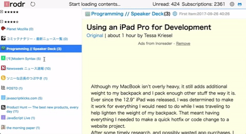
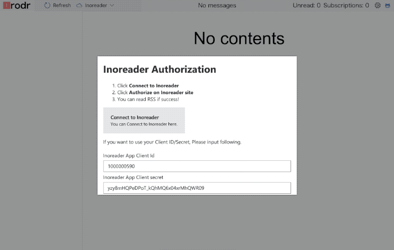

# Irodr [](https://github.com/azu/irodr/actions?query=workflow%3A"test")

A keyboard-driven reader for [Inoreader](https://www.inoreader.com/ "Inoreader") and GitHub Notifications.

Irodr provides a similar experience to [LDR](http://reader.livedoor.com/): feeds with unread items are listed on the left,
`s`/`a` move between feeds, `j`/`k` move between items, and a feed is marked read when you leave it.



## Features

- Fast reading like LDR
  - Prefetches the next feeds, so moving to them is instant
  - Marks a feed read when you move to another one, through the newest item you have loaded
  - Keyboard shortcuts for everything
- Sources side by side: Inoreader feeds and GitHub notifications (grouped by repository) in one list
- Customizable by user scripts through [`window.userScript`](./docs/userscript.md)

## Usage



1. Open <https://irodr.netlify.app/>
2. **Sources** opens automatically. Click **Connect to Inoreader**
3. Click **Authorize** on the Inoreader site

### GitHub Notifications

In **Sources**, enter a classic GitHub personal access token with the `notifications` scope and click **Connect GitHub**.
Sources links to GitHub's token form with the scopes already selected.
Unread notifications of every type are grouped by repository under **GitHub Notifications**.
Moving to another feed marks the departed repository's notifications read on GitHub, through the newest loaded notification.
**Shift+S** skips without marking read, and **m** marks the current feed read without moving.
Inoreader login is not required.

The token and cached notifications are stored unencrypted in this browser.
See [Source adapters](./docs/source-adapters.md) for details, storage and limitations.

### Keyboard Shortcuts

| Key                                                  | Action                                                |
| ---------------------------------------------------- | ----------------------------------------------------- |
| <kbd>j</kbd> / <kbd>k</kbd>                          | Next / previous item                                  |
| <kbd>s</kbd> / <kbd>a</kbd>                          | Next / previous feed (leaving a feed marks it read)   |
| <kbd>Shift</kbd>+<kbd>s</kbd>                        | Skip to the next feed without marking the current one |
| <kbd>m</kbd>                                         | Mark the current feed read                            |
| <kbd>Shift</kbd>+<kbd>j</kbd>                        | Show all items and load older ones                    |
| <kbd>t</kbd>                                         | Toggle unread / all items                             |
| <kbd>v</kbd>                                         | Open the current item in a new tab                    |
| <kbd>z</kbd>                                         | Collapse / expand all categories                      |
| <kbd>Space</kbd> / <kbd>Shift</kbd>+<kbd>Space</kbd> | Scroll down / up                                      |
| <kbd>Shift</kbd>+<kbd>t</kbd>                        | Toggle translate mode (English → Japanese)            |
| <kbd>Shift</kbd>+<kbd>h</kbd>                        | Print read items of this session to the console       |

Shortcuts use the physical key, so they also work with non-Latin keyboard layouts.
Irodr supports current browsers: features that are [Baseline Widely available](https://developer.mozilla.org/en-US/docs/Glossary/Baseline/Compatibility).
Preferences saved by irodr 1.x are carried over on the first start.

### Custom Inoreader Client ID and Client Secret

To use your own Inoreader app:

1. Visit https://www.inoreader.com/ and open **Preferences → Developer**
2. Create a new app with the **Read and Write** scope (a redirect URL is not required)
3. In irodr's **Sources**, open **Use your own Inoreader app**, enter its Client ID and Client Secret, and click **Connect to Inoreader**

## User Script API

Irodr provides an API for user scripts such as Greasemonkey scripts:

- `window.addEventListener("userscript-init", (event) => { /* window.userScript is ready */ })`
- `window.userScript.getActiveContent()`
- `window.userScript.getActiveSubscription()`
- `window.userScript.triggerKey(keys)` / `window.userScript.registerKey(keys, handler)`
- `window.userScript.event.subscribe("SubscriptionContent::componentDidMount", handler)`

See the [User Script API document](./docs/userscript.md) and [resources/userScript](./resources/userScript).

## CORS

Inoreader's API does not allow CORS, so irodr sends Inoreader requests through a proxy.

- Production (<https://irodr.netlify.app/>): a [Netlify Edge Function](./netlify/edge-functions/cors-proxy.ts) at `/cors-proxy/`
- Development: the Vite dev server proxies the same path (see `vite.config.ts`)
- Without a proxy: install [irodr-cors.js](./resources/userScript/irodr-cors.js), or use your own proxy with [irodr-custom-cors-proxy.js](./resources/userScript/irodr-custom-cors-proxy.js)

GitHub's API allows CORS and is called directly.

## Development

Irodr is a client-side React application built with [Vite+](https://viteplus.dev/) (`vp`),
[React](https://react.dev/) with [React Compiler](https://react.dev/learn/react-compiler), and [StyleX](https://stylexjs.com/).

```sh
pnpm install          # or: vp install
pnpm run dev          # http://localhost:8888/
pnpm run check        # vp check: format (Oxfmt), lint (Oxlint) and type check
pnpm run fix          # vp check --fix
pnpm test             # vp test: unit tests (Vitest)
pnpm run test:e2e     # integration tests (Playwright) against fake Inoreader and GitHub APIs
pnpm run build        # production build into dist/
```

The pre-commit hook (`.vite-hooks/pre-commit`) formats and lints staged files and runs the unit tests.
It is installed by `pnpm install` (`vp config`).

- [Architecture](./docs/architecture.md): layers, and how to add a new source
- [Source adapters](./docs/source-adapters.md): Inoreader and GitHub Notifications behavior
- [AGENTS.md](./AGENTS.md): conventions for coding agents

## Changelog

See [Releases page](https://github.com/azu/irodr/releases).

## Code of Conduct

Please note that this project is released with a [Contributor Code of Conduct](./CODE_OF_CONDUCT.md).
By participating in this project you agree to abide by its terms.

## Contributing

Pull requests and stars are always welcome.

For bugs and feature requests, [please create an issue](https://github.com/azu/irodr/issues).

1. Fork it!
2. Create your feature branch: `git checkout -b my-new-feature`
3. Commit your changes: `git commit -am 'Add some feature'`
4. Push to the branch: `git push origin my-new-feature`
5. Submit a pull request :D

## Author

- [github/azu](https://github.com/azu)
- [twitter/azu_re](https://twitter.com/azu_re)

## License

MIT © azu

## OSS Supports

<a href="https://www.netlify.com">
  
</a>
